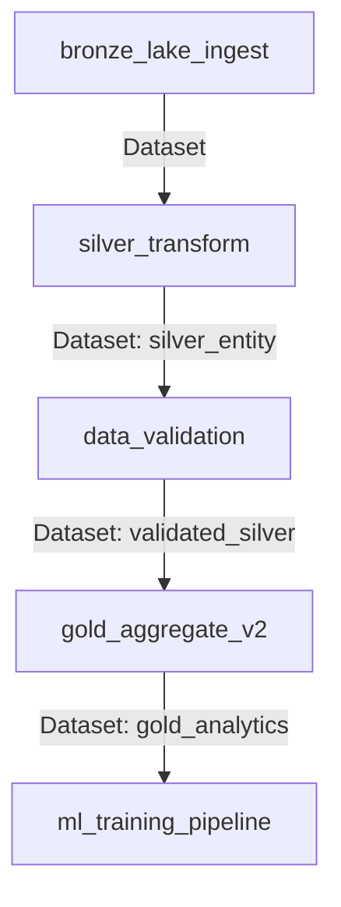

# 🏗️ Data Lakehouse ELT Pipeline — GCP + BigLake + BigQuery + Airflow (Astro)

A production-grade **Data Lakehouse ELT pipeline** on Google Cloud Platform using the **Yelp Open Dataset**, orchestrated by **Airflow on Astronomer (Astro)**.


## 🏛️ Architecture

```
                    ┌─────────────────────────────────────┐
                    │     Airflow (Astronomer / Astro)     │
                    │   Data-Aware Scheduling · Alerting   │
                    └────────────────┬────────────────────┘
                                    │
           ┌────────────────────────┼────────────────────────┐
           ▼                        ▼                        ▼
   ┌──────────────┐      ┌──────────────────┐     ┌──────────────────┐
   │ 🥉 BRONZE    │      │ 🥈 SILVER        │     │ 🥇 GOLD          │
   │ GCS + BigLake│ ───▶ │ BigQuery Native  │ ──▶ │ BigQuery + MVs   │
   │ Raw JSON     │      │ Partitioned      │     │ Aggregated       │
   │ BigLake Ext. │      │ SCD Type 2       │     │ ML Features      │
   └──────────────┘      └──────────────────┘     └────────┬─────────┘
                                                           │
                            ┌──────────────────────────────┼────────┐
                            ▼                              ▼        ▼
                   ┌──────────────────┐         ┌──────────────┐  ┌─────────┐
                   │ Dataflow DLQ     │         │ BigQuery ML  │  │ Cloud   │
                   │ ParDo Validation │         │ CREATE MODEL │  │ Monitor │
                   │ Side Outputs     │         │ ML.EVALUATE  │  │ Alerts  │
                   └──────────────────┘         └──────────────┘  └─────────┘
```

## 🎯 Features

| Feature | Implementation |
|---------|---------------|
| **Medallion Architecture** | Bronze (BigLake/GCS) → Silver → Gold (BigQuery) |
| **Batch Ingestion** | Yelp JSON → GCS with BigLake External Tables |
| **SCD Type 2** | Robust historical tracking with `hash_diff` & `is_current` |
| **Stored Procedures** | Optimized BigQuery procedural SQL (`sp_upsert_business`) |
| **PII Handling** | High-entropy masking (initial + asterisks) + DLP |
| **Soda Data Quality** | `duplicate_count` & schema validation as a Gold Layer gate |
| **Idempotency** | No lookback filters; safe for infinite re-runs |
| **Data-Aware Scheduling** | Airflow Datasets (Silver → Validation → Gold → ML) |

## 📂 Project Structure

```
├── Dockerfile                          # Astro Runtime + GCP packages
├── requirements.txt                    # Python dependencies
├── packages.txt                        # System packages (Java for Iceberg)
├── .env                                # GCP configuration
├── airflow_settings.yaml               # Connections, pools, variables
│
├── dags/
│   ├── bronze_lake_ingest.py           # 🥉 BigLake external table creation
│   ├── silver_transform.py            # 🥈 Transform + PII masking + SP Calls
│   ├── gold_aggregate.py              # 🥇 Business analytics aggregations
│   ├── ml_training_pipeline.py        # 🤖 BigQuery ML training
│   ├── data_validation.py             # ✅ Dataflow DLQ + Soda checks
│   └── common/
│       ├── dag_config.py              # Shared config & defaults
│       └── callbacks.py               # Email alerting callbacks
│
├── include/
│   ├── schemas/
│   │   └── yelp_schemas.py            # Schema definitions (all entities)
│   ├── utils/
│   │   ├── json_handler.py            # JSON flattening & type coercion
│   │   └── gcs_helpers.py             # GCS upload/download wrappers
│   ├── pii/
│   │   └── sensitive_data_protection.py # DLP inspection & masking
│   ├── schema_evolution/
│   │   └── evolve.py                  # Schema change detection
│   └── sql/
│       ├── silver/                    # Procedures (sp_upsert_business.sql)
│       ├── gold/                      # Gold aggregation queries
│       └── ml/                        # CREATE MODEL & EVALUATE
│
├── dataflow/
│   └── validation_pipeline.py         # Beam ParDo/DoFn DLQ pipeline
│
├── infrastructure/
│   └── terraform/
│       ├── main.tf                    # GCS, BigQuery, BigLake, KMS
│       ├── variables.tf               # Input variables
│       ├── outputs.tf                 # Resource outputs
│       └── monitoring.tf             # Alert policies & notifications
│
├── data/                              # Place Yelp JSON files here
└── tests/                             # DAG and unit tests
```

## 🚀 Quick Start

### Prerequisites

- [Astro CLI](https://www.astronomer.io/docs/astro/cli/install-cli)
- [Docker Desktop](https://www.docker.com/products/docker-desktop)
- [Google Cloud SDK](https://cloud.google.com/sdk/docs/install)
- [Terraform](https://developer.hashicorp.com/terraform/install) (optional, for infra provisioning)

### 1. Clone and Configure

```bash
cd complete-data-pipeline-gcp-airflow

# Edit .env with your GCP project ID and region
nano .env
```

### 2. Download the Yelp Dataset

1. Go to [Yelp Open Dataset](https://www.yelp.com/dataset/download)
2. Accept the license agreement
3. Download and extract the JSON files
4. Place them in the `data/` directory:
   ```
   data/
   ├── yelp_academic_dataset_business.json
   ├── yelp_academic_dataset_review.json
   ├── yelp_academic_dataset_user.json
   ├── yelp_academic_dataset_checkin.json
   └── yelp_academic_dataset_tip.json
   ```

### 3. Provision GCP Infrastructure

```bash
cd infrastructure/terraform
terraform init
terraform plan -var="project_id=YOUR_GCP_PROJECT"
terraform apply -var="project_id=YOUR_GCP_PROJECT"
```

### 4. Start Airflow Locally

```bash
astro dev start
```

Access the Airflow UI at http://localhost:8080 (admin/admin).

### 5. Run the Pipeline

The DAGs are connected via **Data-Aware Scheduling** to ensure a quality-gated flow:



1. **Bronze**: Raw files are mapped to BigLake tables.
2. **Silver**: Data is cleaned and deduplicated (SCD Type 2).
3. **Validation**: **Soda Core** runs DQ checks (uniqueness, schema).
4. **Gold**: Aggregations only run if validation passes.
5. **ML**: Training triggers automatically when analytics tables refresh.

## 📊 ML Models (BigQuery ML)

| Model | Type | Target | Features |
|-------|------|--------|----------|
| Star Rating Prediction | `LINEAR_REG` | Review stars (1-5) | Business avg stars, user history, text length |
| Elite User Prediction | `LOGISTIC_REG` | Elite status (0/1) | Review count, compliments, friend count |
| Business Clustering | `KMEANS` | 6 segments | Stars, review count, location |

## 🔐 PII Handling

Uses **GCP Sensitive Data Protection** (DLP):
- **Detection**: 150+ InfoTypes (PERSON_NAME, EMAIL, PHONE, ADDRESS)
- **Masking**: Column-level policy tags with data masking rules
- **Reversible**: `DLP_DETERMINISTIC_ENCRYPT` with KMS keys
- **Scope**: `user.name`, `review.text`, `tip.text`, `business.address`

## 🔔 Alerting

| Alert | Channel | Trigger |
|-------|---------|---------|
| DAG Failure | Email (wira.hutomo2@gmail.com) | Any task failure |
| Duration Degradation | Email | DAG run > threshold |
| Scheduler Down | Email | No heartbeat for 10min |

## 📝 License

This project uses the [Yelp Open Dataset](https://www.yelp.com/dataset) which is subject to the Yelp Dataset License Agreement.
